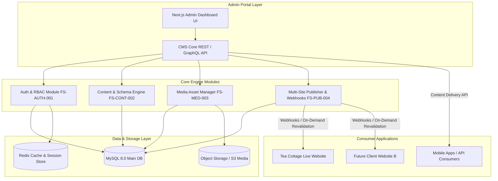
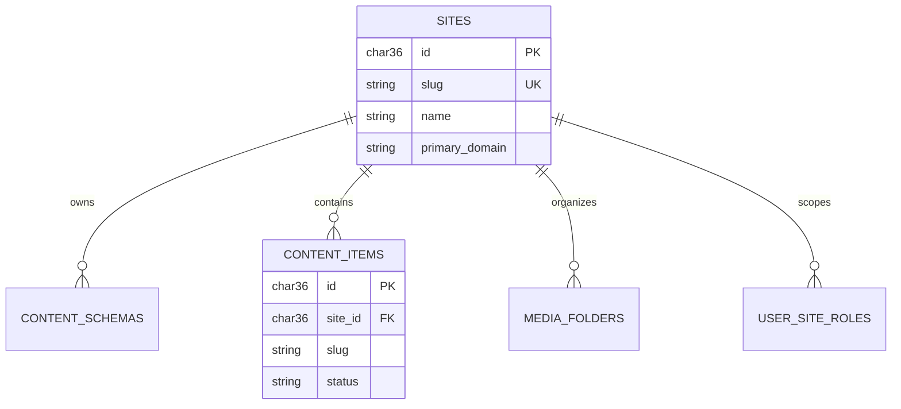

# Functional Specification: CMS Portal Architecture & System Overview

| Document Metadata | Value |
| :--- | :--- |
| **Document ID** | FS-ARCH-000 |
| **Authority** | **SINGLE SOURCE OF TRUTH (SSOT)** for System Architecture Scope |
| **Module Name** | Core System Architecture & Multi-Site CMS Engine |
| **Target Technology Stack** | **Next.js 14+ (App Router, TypeScript)** & **Multi-Database Support (MySQL 8.0+ / MSSQL LocalDB)** |
| **Status** | Approved |
| **Version** | 1.0.0 |
| **Author** | System Architecture Team |

> [!IMPORTANT]
> **Single Source of Truth (SSOT) Governance**:
> This Functional Specification is the authoritative Single Source of Truth (SSOT) for the high-level architecture, module boundaries, system scope, and multi-tenant domain models of the CMS Admin Portal. All module-level functional specs (Auth, Content Modeling, Media Library, Publishing) derive their constraints from this master architecture spec.

---

## 1. System Vision & Architectural Scope

### 1.1 Overview
The **CMS Management System** is a decoupled, extensible, multi-tenant Headless Content Management Portal built to manage multiple web properties from a single administrative dashboard. 

The primary pilot property is the **Tea Cottage Website**, but the portal architecture is completely site-agnostic, enabling administrators to seamlessly onboard and manage additional websites, mobile app content feeds, and digital touchpoints.

### 1.2 System Context & Component Boundaries



---

## 2. Core Functional Modules & Responsibilities

| Module Code | Module Name | Primary Responsibilities |
| :--- | :--- | :--- |
| **FS-AUTH-001** | **Authentication & RBAC** | Admin staff identity, site-scoped roles (`Super Admin`, `Site Admin`, `Editor`, `Publisher`), session security, invitation onboarding, audit logs. |
| **FS-CONT-002** | **Dynamic Content Engine** | Dynamic schema definition (Pages, Catalog, Posts), custom field types (Text, RichText, Gallery, References), version control, drafts. |
| **FS-MED-003** | **Media Library & Asset Manager** | File uploads, image optimization, folder organization, metadata tagging, CDN URL delivery. |
| **FS-PUB-004** | **Multi-Site Publishing Pipeline** | Release staging, approval workflows, static site generator (SSG) build triggers, Next.js on-demand ISR revalidation webhooks. |
| **FS-SET-005** | **Site Settings & Locales** | Site domain binding, branding parameters, multi-language internationalization (i18n), SEO default metadata. |

---

## 3. Multi-Tenant & Multi-Site Isolation Model

### 3.1 Tenant Isolation Strategy
The CMS adopts a **Shared Database, Discriminator Column (`site_id`)** architecture to balance high performance, cost efficiency, and simplified cross-site reporting for Super Admins.



### 3.2 Site Context Resolution
Whenever an admin user operates within the Admin Portal:
1. The active **`site_id`** context is selected via the global Site Switcher UI component.
2. All subsequent API queries implicitly include `WHERE site_id = :active_site_id`.
3. Permission middleware validates that `User.site_roles[active_site_id]` permits the attempted action.

---

## 4. Admin Portal User Experience & Core Layout

The Admin Portal user interface is structured around a unified dashboard layout:

```text
+-----------------------------------------------------------------------------------+
|  Logo  | Site Switcher: [ Tea Cottage Website v ]  |  Search... | Profile (Admin) |
+-----------------------------------------------------------------------------------+
|  Navigation Sidebar  |  Main Content Canvas                                       |
|                      |                                                            |
|  [D] Dashboard       |  Page Title: Pages - Tea Cottage                           |
|  [P] Pages            |  + Create New Page                                         |
|  [C] Collections     |  --------------------------------------------------------  |
|  [M] Media Library   |  Title                Slug          Status     Updated     |
|  [U] Users & Roles   |  --------------------------------------------------------  |
|  [S] Settings        |  Home Page            /             Published  Oct 7, 2026  |
|                      |  Our Tea Menu         /tea-menu     Draft      Oct 6, 2026  |
|                      |  Contact Us           /contact      Published  Oct 1, 2026  |
+-----------------------------------------------------------------------------------+
```

---

## 5. Multi-Database Engine Strategy & Connection Requirements

### 5.1 Dual Environment Engine Requirement
To support diverse developer environments and cloud deployments, the CMS Portal MUST support running against multiple relational database providers cleanly:
* **Local Development Engine**: Microsoft SQL Server Express LocalDB (`(localdb)\MSSQLLocalDB`) on Windows.
* **Production / Cloud Engine**: MySQL 8.0+ (InnoDB) or PostgreSQL.
* **Provider Switching**: The active database engine MUST be configurable via a single environment flag (`DB_PROVIDER=mssql` or `DB_PROVIDER=mysql`), executing through a unified database strategy adapter without requiring code changes.

### 5.2 Environment Schema Validation Requirement
* **Startup Validation**: System startup MUST validate database environment configuration using strict **Zod** schemas.
* **Actionable Error Reporting**: If a connection parameter is missing (e.g. missing `Driver={...}` in LocalDB connection string or invalid credentials), the system MUST output actionable human-readable diagnostic messages instead of crashing silently.

### 5.3 Automated Connection Health Check Requirement
* **CLI Health Checker**: The portal MUST include an automated CLI health checker (`npm run db:check`) that validates database connectivity, measures query latency, and verifies key schema tables prior to launching the server.

---

## 6. Non-Functional & Quality Attributes

1. **Performance**: Page loads within the Admin Portal must render in under 800ms. Content Delivery API responses served in <50ms (via caching).
2. **Security**: OWASP Top 10 compliance, Argon2id password encryption, SameSite Strict cookies, strict input sanitization against XSS/SQLi.
3. **Availability & Resilience**: Database connections pooled; graceful degradation if external media S3 bucket or webhook targets are temporarily unreachable.
4. **Scalability**: Capable of scaling from 1 site (Tea Cottage) to 100+ managed sites without database schema migration changes.

---

## 7. Verification & Acceptance Criteria

1. **Modular Consistency**: Every sub-module functional spec (`01-authentication-spec.md`, `02-content-schema-spec.md`, etc.) must strictly adhere to the `site_id` discriminator multi-tenant architecture.
2. **Site Scoping Rule**: No cross-site data leakage allowed under any non-Super-Admin session context.
3. **Decoupled Architecture**: Live sites (e.g. Tea Cottage) access published content strictly via API or Webhook triggers, never directly reading database state during user requests.
