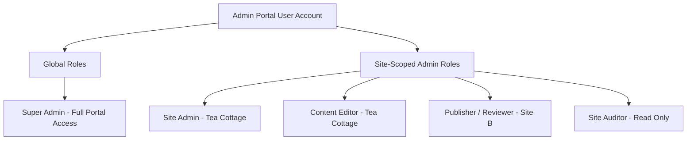
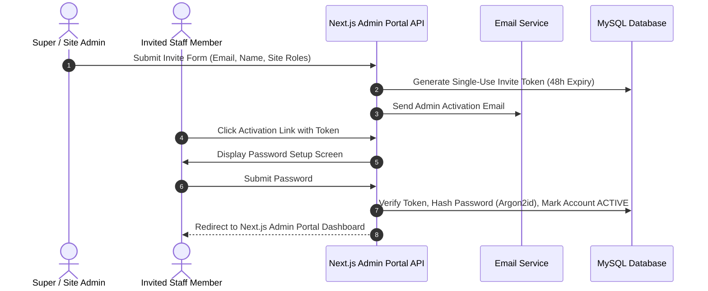
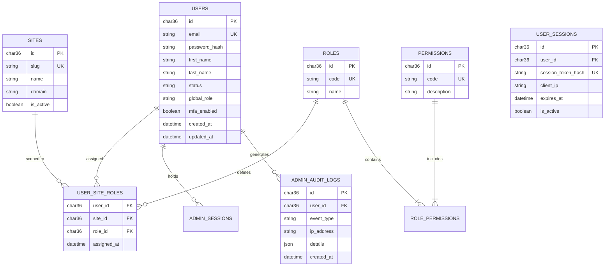

# Functional Specification: CMS Admin Portal Authentication & Authorization

| Document Metadata | Value |
| :--- | :--- |
| **Document ID** | FS-AUTH-001 |
| **Authority** | **SINGLE SOURCE OF TRUTH (SSOT)** for Auth Requirements & Logic |
| **Module Name** | Core Identity, Authentication & Authorization |
| **System Scope** | CMS Admin Portal (Management Dashboard for Tea Cottage & Future Sites) |
| **Target Technology Stack** | **Next.js** (App Router / React) & **MySQL 8.0+** |
| **Status** | Approved |
| **Version** | 1.3.0 |
| **Author** | System Architecture Team |

> [!IMPORTANT]
> **Single Source of Truth (SSOT) Governance**:
> This Functional Specification document is the authoritative Single Source of Truth (SSOT) for all business logic, user personas, permission matrices, security rules, and functional behaviors of the Authentication & Authorization module. Any Technical Specification, database schema design, or API implementation MUST strictly conform to the requirements defined in this document. Any proposed functional changes MUST be updated in this document first before technical implementation.

---

## 1. Executive Summary & Scope

### 1.1 Objective
The purpose of this document is to define the functional, security, data, and API specifications for the **Authentication & Authorization Module** specifically designed for the **CMS Admin Portal**.

The CMS Admin Portal is built on **Next.js** (utilizing App Router & React) connected to a **MySQL** relational database backend. It serves as the centralized management dashboard used by staff, administrators, content creators, and reviewers to manage content, media, configurations, and publishing workflows across multiple web properties (starting with the Tea Cottage website, with architectural capacity for additional sites).

### 1.2 System Boundary & Context
* **Target Interface**: CMS Admin Management Portal (Next.js Application Dashboard).
* **Single Admin Identity (SSO Across Managed Sites)**: An admin user logs into the Admin Portal once and can switch context between assigned websites (e.g. Tea Cottage, Site B) based on their assigned site permissions.
* **Hybrid Session Architecture**: 
  - Primary Admin Portal Web Access: **SameSite HTTP-Only Secure Cookies** with CSRF token protection for maximum web security.
  - Admin REST/GraphQL APIs: Supports **Bearer JWT Access Tokens** for automated administrative tools, CLI extensions, or build pipeline webhooks.
* **Phased MFA**: Designed with database extension points for Multi-Factor Authentication (MFA / TOTP) to be enabled in Phase 2 for elevated admin accounts.

---

## 2. Admin Personas & Role-Based Access Control (RBAC)

### 2.1 Admin User Hierarchy

#### 2.2 Role Definitions

1. **Super Admin (Global System Admin)**:
   - Unrestricted access across the entire CMS Admin Portal.
   - Manages platform configuration, creates new sites/tenants, manages global admin accounts, and views system-wide security audit logs.

2. **Site Administrator (Site-Scoped)**:
   - Full management rights for specific assigned websites (e.g. Tea Cottage Admin).
   - Manages site settings, navigation structure, site-specific media libraries, and assigns site-scoped roles to editors and publishers.

3. **Content Editor (Site-Scoped)**:
   - Creates, edits, and organizes content pages, blog entries, tea catalog items, and media assets for assigned sites.
   - Saves drafts and submits content for review. Cannot publish directly to production web environments.

4. **Publisher / Reviewer (Site-Scoped)**:
   - Reviews pending content drafts.
   - Approves, schedules, publishes, and unpublishes site content to production.

5. **Site Auditor / Previewer (Site-Scoped)**:
   - Read-only access to inspect draft pages, preview unpublished changes, and audit site content history.

---

## 3. Admin Portal Functional Capabilities & Workflows

### 3.1 Admin Account Onboarding (Invitation Only)

To maintain maximum security, **public self-registration for the Admin Portal is strictly disabled**. All admin portal accounts are created via administrator invitation.

---

### 3.2 Admin Authentication & Session Management

#### Web Admin Portal Dashboard Flow
1. Staff member accesses the Admin Portal login screen (`/admin/login`).
2. Submits credentials (Email + Password).
3. On successful verification, the Next.js API route issues an encrypted `cms_admin_session` cookie configured with:
   - `HttpOnly: true` (prevents JavaScript/XSS extraction)
   - `Secure: true` (HTTPS required)
   - `SameSite: Strict` (mitigates cross-site request forgery)
   - `Path: /`
4. The Next.js Admin Portal loads user profile metadata (`/api/v1/admin/auth/me`), rendering navigation menus matching the user's explicit permissions.

#### Admin Session Timeout & Inactivity Rules
* **Inactivity Timeout**: Admin Portal sessions automatically expire after 60 minutes of inactivity.
* **Absolute Session Lifetime**: Maximum 12 hours before re-authentication is required.
* **Concurrent Session Control**: Admin users can view active sessions and revoke logins across devices.

---

### 3.3 Password Management & Security Policies

* **Password Complexity Standard**:
  - Minimum 12 characters.
  - Requires uppercase, lowercase, numeric, and special characters (`@#$%^&*`).
* **Hashing Specification**:
  - **Argon2id** (Memory: 64MB, Iterations: 3, Parallelism: 4) or **bcrypt** (Cost factor 12+).
* **Password Reset Workflow**:
  - Initiated from Admin Portal login screen via `/admin/forgot-password`.
  - Sends a secure 15-minute expiring link to the registered admin email address.
  - Resetting password invalidates all existing active admin sessions.

---

### 3.4 Multi-Factor Authentication (MFA Roadmap)

> [!NOTE]
> **Phase 1**: MFA is optional/deferred for initial Admin Portal launch.
> **Phase 2 Target**: TOTP-based 2FA (Google Authenticator / Authy) will be enforced for elevated roles (`Super Admin`, `Site Admin`). Database schemas pre-include `mfa_enabled`, `mfa_secret`, and `backup_codes` columns.

---

### 3.5 Admin Logout & Session Invalidation Workflow

When a staff member clicks the **Logout** button within the CMS Admin Portal header or dashboard:
1. **User Action**: The client triggers a request to `POST /api/v1/admin/auth/logout`.
2. **Session Invalidation**: The Next.js API route resolves the active `cms_admin_session` cookie token, updates the session record in `user_sessions` by setting `is_revoked = 1`, and invalidates any subsequent requests using this token.
3. **Cookie Revocation**: The HTTP-Only `cms_admin_session` cookie is deleted from the client browser by setting `maxAge: 0` and an expired timestamp.
4. **Audit Logging**: An immutable audit record with event type `ADMIN_LOGOUT` is written to `admin_audit_logs`.
5. **Client Redirection**: The user interface clears local application context and redirects the browser back to `/admin/login?logged_out=true`.

---

## 4. Multi-Site Permission Matrix & Scoping Engine

### 4.1 Permission Mapping Table

Permissions follow a structured namespace pattern (`<domain>:<resource>:<action>`).

| Permission Code | Super Admin | Site Admin | Content Editor | Publisher | Auditor |
| :--- | :---: | :---: | :---: | :---: | :---: |
| `admin:users:manage` | ✅ | ❌ | ❌ | ❌ | ❌ |
| `admin:sites:create` | ✅ | ❌ | ❌ | ❌ | ❌ |
| `site:settings:update` | ✅ | ✅ (Own Site) | ❌ | ❌ | ❌ |
| `site:users:invite` | ✅ | ✅ (Own Site) | ❌ | ❌ | ❌ |
| `content:pages:create` | ✅ | ✅ | ✅ | ✅ | ❌ |
| `content:pages:update` | ✅ | ✅ | ✅ | ✅ | ❌ |
| `content:pages:publish` | ✅ | ✅ | ❌ | ✅ | ❌ |
| `content:pages:delete` | ✅ | ✅ | ❌ | ❌ | ❌ |
| `content:pages:preview` | ✅ | ✅ | ✅ | ✅ | ✅ |
| `media:upload` | ✅ | ✅ | ✅ | ✅ | ❌ |

---

## 5. Security Controls & Audit Logging

### 5.1 Admin Portal Brute Force Mitigation
* **Failed Attempt Limit**: 5 consecutive failed login attempts lock the admin account for 15 minutes.
* **Notification**: Email notification sent to the admin user notifying them of suspicious failed login attempts.
* **Rate Limiting**: `/api/v1/admin/auth/*` endpoints throttled to max 15 requests per minute per IP.

### 5.2 Admin Action Audit Trail
All administrative actions in the portal are logged to an immutable MySQL `admin_audit_logs` record for compliance and operational tracking.

---

## 6. Conceptual Database Schemas

### 6.1 Entity Relationship Diagram

---

## 7. Admin API Interface Specifications (Next.js Route Handlers)

### 7.1 Admin Auth Endpoints

| Method | Next.js App Route | Purpose | Access |
| :--- | :--- | :--- | :--- |
| `POST` | `/app/api/v1/admin/auth/login/route.ts` | Authenticate staff member into Admin Portal | Public |
| `POST` | `/app/api/v1/admin/auth/logout/route.ts` | Log out & invalidate session cookie | Admin Session |
| `GET` | `/app/api/v1/admin/auth/me/route.ts` | Fetch active admin profile & assigned site roles | Admin Session |
| `POST` | `/app/api/v1/admin/auth/forgot-password/route.ts` | Request admin password reset email | Public |
| `POST` | `/app/api/v1/admin/auth/reset-password/route.ts` | Complete password reset | Public |
| `POST` | `/app/api/v1/admin/users/invite/route.ts` | Invite new staff member to Admin Portal | Super / Site Admin |

---

## 8. Verification & Acceptance Criteria

1. **Next.js & MySQL Integration**: Admin Portal runs cleanly on Next.js with MySQL connection pool (`mysql2` / Prisma / Drizzle ORM).
2. **Admin Security Boundary**: Public self-registration is disabled. Only invited staff members can access the Admin Portal.
3. **Site Context Switching**: An admin assigned to multiple sites (e.g. Tea Cottage and Site B) can seamlessly switch active site context within Next.js Admin Portal.
4. **Audit Record Compliance**: All admin logins, content publishing actions, and user role modifications produce immutable records in MySQL `admin_audit_logs`.
