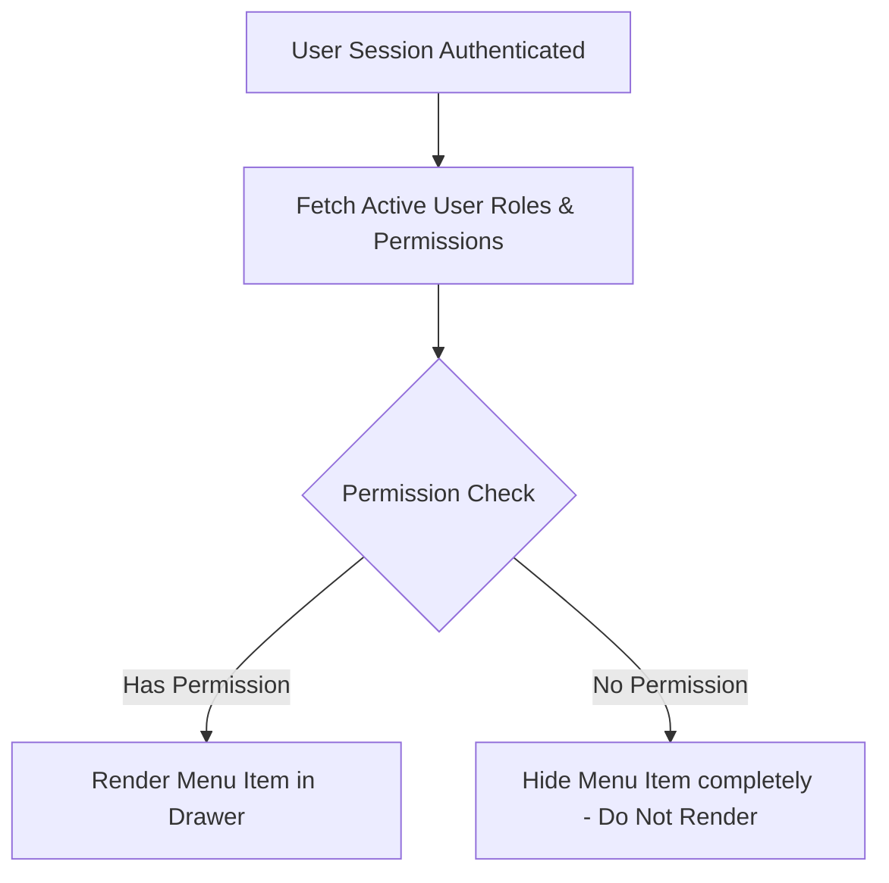
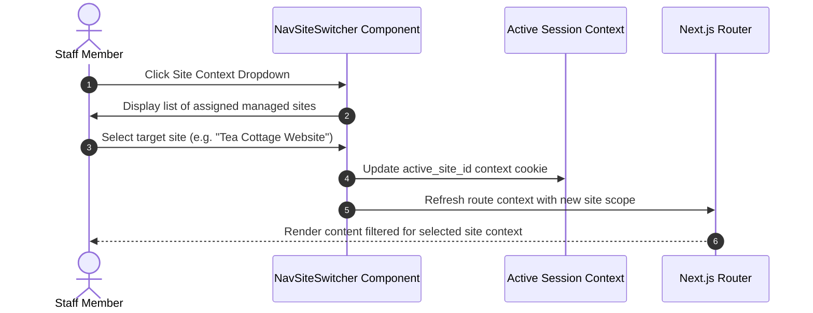

# Functional Specification: Navigation Drawer, Menu Items & Site Context Switcher

| Document Metadata | Value |
| :--- | :--- |
| **Document ID** | FS-NAV-002 |
| **Authority** | **SINGLE SOURCE OF TRUTH (SSOT)** for Navigation Architecture & UI |
| **Module Name** | Core Portal Navigation, Navigation Drawer & Multi-Site Switcher |
| **System Scope** | Multi-Site Management Portal (Tea Cottage & Future Managed Sites) |
| **Target Technology Stack** | **Next.js 14+** (App Router / React) & **MySQL 8.0+** |
| **Status** | Approved |
| **Version** | 1.0.0 |
| **Author** | System Architecture Team |

> [!IMPORTANT]
> **Single Source of Truth (SSOT) Governance**:
> This Functional Specification is the authoritative Single Source of Truth (SSOT) for all business rules, navigation hierarchy, role-based menu filtering, site context switching workflows, and user drawer interactions across the portal. Any Technical Specification, database schema design, or React component implementation MUST strictly conform to this document.

---

## 1. Executive Summary & Scope

### 1.1 Objective
The purpose of this document is to define the functional, visual layout, permission scoping, data, and API specifications for the **Navigation Drawer**, **Menu Items**, and **Site Context Switcher** module.

The portal serves as a multi-site management dashboard. The Navigation Drawer provides the primary application layout structure, enabling staff members to navigate between content management modules, media libraries, platform settings, and security logs while seamlessly switching active site contexts.

### 1.2 System Boundary & Key Layout States
The Navigation Drawer supports three distinct layout viewport states:
1. **Desktop Expanded Drawer (Default)**:
   - Width: `240px`.
   - Displays full logo branding, site context switcher, expanded menu item text labels, collapsible section accordions, and user profile footer.
2. **Desktop Collapsed Drawer (Icon-Only Mode)**:
   - Width: `64px`.
   - Collapses to icon-only mode to maximize workspace canvas area. Hovering or focusing icons displays accessible tooltips with menu item labels.
3. **Mobile Drawer (Overlay Sheet)**:
   - Triggered via topbar hamburger icon button.
   - Slides in as a modal drawer overlay sheet with backdrop blur.

### 1.3 User Stories

* **US-NAV-01 (Drawer Mode Toggle)**: As a staff member, I want to toggle between expanded and collapsed icon-only drawer modes, so that I can optimize my visual screen canvas when managing Tea Cottage content.
* **US-NAV-02 (Site Context Switching)**: As a multi-site staff member, I want to switch my active site context via a drawer header dropdown, so that I can seamlessly manage different tenant sites without logging out.

### 1.4 System Use Cases

#### UC-NAV-001: Navigation Drawer Collapse Toggle
* **Primary Actor**: Authenticated Staff Member
* **Preconditions**: User is logged in and viewing any route within the Tea Cottage Portal.
* **Main Success Scenario**:
  1. User clicks the drawer collapse toggle button in the drawer footer.
  2. The drawer width animates between `240px` (expanded) and `64px` (collapsed icon-only mode).
  3. The system sets cookie `tea_drawer_collapsed=true`.
  4. Subsequent page navigations render the drawer in collapsed icon-only mode with hover tooltips.
* **Alternative Flow (Expand Drawer)**:
  1. User clicks the collapse toggle button while drawer is collapsed.
  2. The drawer width animates from `64px` back to `240px`.
  3. The system updates cookie `tea_drawer_collapsed=false`.

#### UC-NAV-002: Active Site Context Switcher
* **Primary Actor**: Multi-Site Staff Member
* **Preconditions**: User is logged in with access to multiple managed sites.
* **Main Success Scenario**:
  1. User clicks the `nav-site-switcher` dropdown in the navigation drawer header.
  2. The system presents a list of sites assigned to the user's role.
  3. User selects a target site (e.g. "Tea Cottage Website").
  4. The system sets the `tea_active_site_id` cookie and updates active session context.
  5. Navigation links and dashboard components refresh data scoped to the newly selected site.

---

## 2. Navigation Scoping & Permission Guard Rules

### 2.1 Role-Based Menu Scoping
Navigation menu items are strictly guarded using structured permission codes (`<domain>:<resource>:<action>`). Users only see navigation items matching their assigned global role or active site-scoped role.



### 2.2 Menu Item Permission Matrix

| Menu Item | Path | Permission Code | Super Admin | Site Admin | Editor | Publisher | Auditor |
| :--- | :--- | :--- | :---: | :---: | :---: | :---: | :---: |
| **Dashboard** | `/admin/dashboard` | Public (Authenticated) | ✅ | ✅ | ✅ | ✅ | ✅ |
| **Pages** | `/admin/content/pages` | `content:pages:preview` | ✅ | ✅ | ✅ | ✅ | ✅ |
| **Catalog** | `/admin/content/catalog` | `content:pages:preview` | ✅ | ✅ | ✅ | ✅ | ✅ |
| **Blog Posts** | `/admin/content/blog` | `content:pages:preview` | ✅ | ✅ | ✅ | ✅ | ✅ |
| **Media Library** | `/admin/media` | `media:upload` | ✅ | ✅ | ✅ | ✅ | ❌ |
| **Site Settings** | `/admin/settings` | `site:settings:update` | ✅ | ✅ | ❌ | ❌ | ❌ |
| **User Management**| `/admin/users` | `site:users:invite` | ✅ | ✅ | ❌ | ❌ | ❌ |
| **Audit Logs** | `/admin/audit-logs` | `admin:users:manage` | ✅ | ❌ | ❌ | ❌ | ❌ |

---

## 3. Navigation Functional Workflows

### 3.1 Multi-Site Context Switching Workflow

Staff members assigned to multiple managed sites (e.g., Tea Cottage Website and future web properties) can switch site context directly from the top section of the Navigation Drawer.



---

### 3.2 Drawer Collapsible State & Subgroup Accordion Workflow

1. **Drawer Collapse Toggle**:
   - Staff member clicks the collapse toggle button (`ChevronLeft` / `ChevronRight`) at the bottom of the drawer.
   - The drawer width smoothly animates between `240px` and `64px`.
   - The user preference is saved in cookie `tea_drawer_collapsed` to preserve state across page reloads.

2. **Group Accordion Expand / Collapse**:
   - Menu items are organized into collapsible groups (e.g. "Content Engine", "Administration").
   - Clicking a group header expands or collapses child navigation links.
   - If a child item is active, its parent group remains expanded by default.

---

## 4. Menu Item Specifications & Structure

### 4.1 Menu Hierarchy

1. **Header Section**:
   - Platform Brand Logo & Title.
   - **Site Switcher (`nav-site-switcher`)**: Dropdown selector displaying active tenant site name (e.g., "Tea Cottage Website").

2. **Main Navigation Group (`nav-group`)**:
   - **Dashboard**: Icon `LayoutDashboard`, Route `/admin/dashboard`.
   - **Content Engine** (Group): Icon `FileText`.
     - *Pages*: Route `/admin/content/pages`.
     - *Catalog*: Route `/admin/content/catalog`.
     - *Blog*: Route `/admin/content/blog`.
   - **Media Library**: Icon `Image`, Route `/admin/media`.

3. **Administration Group (`nav-group`)**:
   - **Site Settings**: Icon `Settings`, Route `/admin/settings`.
   - **User Management**: Icon `Users`, Route `/admin/users`.
   - **Security Audit Logs**: Icon `ShieldCheck`, Route `/admin/audit-logs`.

4. **Footer Section (`nav-user-profile`)**:
   - User Name & Global Role Badge.
   - **Logout Button (`LogoutButton`)**: Invalidate session & redirect to login screen.

---

## 5. Conceptual Database Schemas

```mermaid
erDiagram
    NAVIGATION_ITEMS ||--o{ NAVIGATION_ITEMS : "parent_of"
    PERMISSIONS ||--o{ NAVIGATION_ITEMS : "guards"
    USERS ||--o{ USER_DRAWER_PREFERENCES : "configures"

    NAVIGATION_ITEMS {
        char36 id PK
        char36 parent_id FK
        string code UK
        string label
        string icon
        string path
        string permission_code FK
        int display_order
        boolean is_active
    }

    USER_DRAWER_PREFERENCES {
        char36 user_id PK_FK
        boolean is_collapsed
        datetime updated_at
    }
```

---

## 6. Navigation API Interface Specifications

| Method | Next.js App Route | Purpose | Access |
| :--- | :--- | :--- | :--- |
| `GET` | `/app/api/v1/admin/navigation/me/route.ts` | Fetch authorized menu tree for active session user | Authenticated Session |

---

## 7. Verification & Acceptance Criteria

1. **Strict RBAC Enforcement**: Menu items for which the user lacks permissions MUST be completely omitted from the DOM.
2. **Active Route Highlighting**: The currently active route (and its parent group) MUST be visibly highlighted with primary leaf green accent styling and clear contrast indicator.
3. **State Persistence**: Collapsing the drawer to 64px icon-only mode MUST persist across page navigation and browser reloads via `tea_drawer_collapsed` cookie.
4. **Site Context Switcher**: Switching site context in `nav-site-switcher` MUST update active site context seamlessly without full page breaks.
5. **Accessibility**: Full keyboard tab navigation, `aria-expanded` attributes on collapsible groups, and screen reader labels on icon-only mode.

---

## 8. Requirements Traceability Matrix (RTM)

| Functional Spec Req ID | User Story ID | Use Case ID | QA Test Case ID | Description |
| :--- | :--- | :--- | :--- | :--- |
| `FS-NAV-01` | `US-NAV-01` | `UC-NAV-001` | `TC-NAV-001` | Drawer mode toggle between expanded (240px) and collapsed (64px) icon-only state |
| `FS-NAV-02` | `US-NAV-02` | `UC-NAV-002` | `TC-NAV-002` | Multi-site context switcher in drawer header |
| `FS-NAV-03` | `US-NAV-01` | `UC-NAV-001` | `TC-NAV-003` | Role-based menu item filtering DOM omission |

