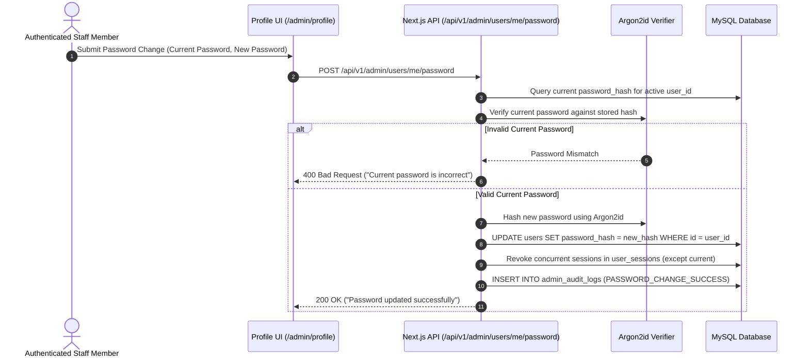

# Functional Specification: Logged User Profile Management & Password Workflow

| Document Metadata | Value |
| :--- | :--- |
| **Document ID** | FS-USR-003 |
| **Authority** | **SINGLE SOURCE OF TRUTH (SSOT)** for User Profile & Security Self-Service |
| **Module Name** | Core Identity, User Profile Management & Account Security |
| **System Scope** | Multi-Site Management Portal (Tea Cottage & Future Managed Sites) |
| **Target Technology Stack** | **Next.js 14+** (App Router / React) & **MySQL 8.0+** |
| **Status** | Approved |
| **Version** | 1.0.0 |
| **Author** | System Architecture Team |

> [!IMPORTANT]
> **Single Source of Truth (SSOT) Governance**:
> This Functional Specification is the authoritative Single Source of Truth (SSOT) for all business logic, user profile modification rules, password change workflows, security audit tracking, and UI layouts for the logged-in user profile page (`/admin/profile`). Any Technical Specification, database query, or React component MUST strictly conform to this document.

---

## 1. Executive Summary & Scope

### 1.1 Objective
The purpose of this document is to define the functional, security, UX, data, and API specifications for the **Logged User Profile Management Module**.

The User Profile page (`/admin/profile`) allows authenticated staff members to inspect their account details, view assigned global and site-scoped roles, update personal information (First Name, Last Name), securely change their account password, and view account security status.

### 1.2 User Capabilities
1. **View Account Summary**: Display full name, email address, global role badge, assigned managed sites list, and account creation timestamp.
2. **Update Personal Information**: Edit First Name and Last Name with real-time Zod validation and immediate feedback.
3. **Change Password**: Authenticate current password, specify a new compliant password, re-hash using Argon2id, invalidate all other active sessions, and record a security audit log.
4. **Account Security Status**: Inspect active session status, last login timestamp, and MFA / 2FA roadmap indicator.

### 1.3 User Stories

* **US-USR-01 (Profile Updates)**: As an authenticated staff member, I want to update my first name and last name on my profile page, so that my display name across Tea Cottage Portal is accurate.
* **US-USR-02 (Password Security)**: As an authenticated staff member, I want to change my account password with current password verification, so that I can maintain account security and invalidate other open sessions if compromised.

### 1.4 System Use Cases

#### UC-USR-001: Profile Info Update
* **Primary Actor**: Authenticated Staff Member
* **Preconditions**: User is logged in and navigated to `/admin/profile`.
* **Main Success Scenario**:
  1. User edits First Name or Last Name fields.
  2. User clicks "Save Changes".
  3. The system validates input via `UserUpdateSchema` (Zod).
  4. The system executes `PATCH /api/v1/admin/users/me`.
  5. The database updates the `users` table record and creates an audit log entry (`PROFILE_UPDATE`).
  6. The UI displays a success alert banner and updates header profile display name.

#### UC-USR-002: Password Change & Session Revocation
* **Primary Actor**: Authenticated Staff Member
* **Preconditions**: User is logged in and navigated to `/admin/profile`.
* **Main Success Scenario**:
  1. User enters Current Password, New Password, and Confirm Password.
  2. User clicks "Update Password".
  3. The system validates new password complexity (minimum 12 chars, uppercase, lowercase, digit, special char).
  4. The system sends `POST /api/v1/admin/users/me/password`.
  5. The backend verifies current password hash using Argon2id.
  6. The backend hashes new password with Argon2id and updates `users` record.
  7. The backend sets `is_revoked = 1` for all other active sessions in `user_sessions`.
  8. The system creates an audit log entry (`PASSWORD_CHANGE_SUCCESS`).
  9. The UI displays a success toast and clears password input fields.
* **Alternative Flow (Invalid Current Password)**:
  1. If current password verification fails, the backend returns HTTP 400 Bad Request.
  2. The UI displays error message "Current password is incorrect".

---

## 2. Workflows & Sequence Diagrams

### 2.1 Password Change Workflow

---

## 3. Security & Validation Rules

### 3.1 Password Complexity Standard
* Minimum 12 characters.
* Must include at least 1 uppercase letter, 1 lowercase letter, 1 number, and 1 special character (`@$!%*?&`).
* Cannot match the current password.

### 3.2 Audit Trail Compliance
Every profile update and password change event MUST generate an immutable audit log record in `admin_audit_logs`:
* `PROFILE_UPDATE`: Logged when first name or last name is modified.
* `PASSWORD_CHANGE_SUCCESS`: Logged when password is changed.

---

## 4. API Interface Specifications

| Method | Next.js App Route | Purpose | Access |
| :--- | :--- | :--- | :--- |
| `GET` | `/app/api/v1/admin/users/me/route.ts` | Fetch detailed active user profile, site roles & permissions | Authenticated Session |
| `PATCH` | `/app/api/v1/admin/users/me/route.ts` | Update active user's first name and last name | Authenticated Session |
| `POST` | `/app/api/v1/admin/users/me/password/route.ts` | Change account password with verification & session cleanup | Authenticated Session |

---

## 5. Verification & Acceptance Criteria

1. **Self-Service Boundaries**: A user can only view and edit their own profile (`/admin/users/me`).
2. **Current Password Verification**: Changing password without providing valid current password MUST return `400 Bad Request`.
3. **Session Revocation**: Changing password MUST set `is_revoked = 1` for all other active sessions of the user in `user_sessions`.
4. **Audit Logging**: Successful profile edits and password changes MUST generate records in `admin_audit_logs`.
5. **No Generic Terms**: All UI text MUST conform to GEMINI.md Section 6 domain branding rules.

---

## 6. Requirements Traceability Matrix (RTM)

| Functional Spec Req ID | User Story ID | Use Case ID | QA Test Case ID | Description |
| :--- | :--- | :--- | :--- | :--- |
| `FS-USR-01` | `US-USR-01` | `UC-USR-001` | `TC-USR-001` | Profile first name and last name update with Zod validation & audit log |
| `FS-USR-02` | `US-USR-02` | `UC-USR-002` | `TC-USR-002` | Account password change with Argon2id re-hashing and concurrent session revocation |

