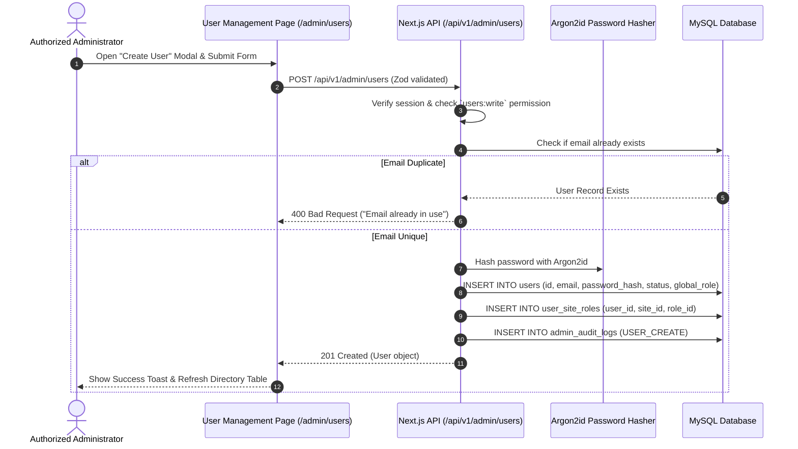

# Functional Specification: User Management Module

| Document Metadata | Value |
| :--- | :--- |
| **Document ID** | FS-UM-004 |
| **Authority** | **SINGLE SOURCE OF TRUTH (SSOT)** for User Account Administration & Role Assignments |
| **Module Name** | Core Identity, User Management & Multi-Site RBAC |
| **System Scope** | Multi-Site Management Portal (Tea Cottage & Future Managed Sites) |
| **Target Technology Stack** | **Next.js 14+** (App Router / React) & **MySQL 8.0+** |
| **Status** | Approved |
| **Version** | 1.0.0 |
| **Author** | System Architecture Team |

> [!IMPORTANT]
> **Single Source of Truth (SSOT) Governance**:
> This Functional Specification is the authoritative Single Source of Truth (SSOT) for all business logic, user administration rules, account creation workflows, role assignment criteria, security audit tracking, and UI layouts for the User Management page (`/admin/users`). Any Technical Specification, database query, or React component MUST strictly conform to this document.

---

## 1. Executive Summary & Scope

### 1.1 Objective
The purpose of this document is to define the functional, security, UX, data, and API specifications for the **User Management Module** within the Tea Cottage Portal.

The User Management dashboard (`/admin/users`) empowers administrators with the `users:read` and `users:write` permissions to view staff accounts, create new staff user accounts, search and filter users by email/name/role/status, edit account details, update global and site-level roles, and suspend or activate accounts.

### 1.2 User Capabilities
1. **User Directory Listing**: Display paginated list of staff users showing full name, email, global role badge, account status (`ACTIVE` / `SUSPENDED`), assigned sites count, and creation date.
2. **Search & Filtering**: Search users in real time by name or email, filter by global role (`SUPER_ADMIN`, `SITE_ADMIN`, `CONTENT_EDITOR`, `VIEWER`), and filter by status (`ACTIVE`, `SUSPENDED`).
3. **Create Staff Account**: Form modal to register new staff members with email, first name, last name, global role, site-specific roles, and password validation.
4. **Edit Account & Status Management**: Update existing user attributes, switch account status between `ACTIVE` and `SUSPENDED`, and manage site-specific role mappings.
5. **Security Audit Trails**: Record `USER_CREATE` and `USER_UPDATE` events in `admin_audit_logs`.

### 1.3 User Stories

* **US-UM-01 (Directory Lookup)**: As an administrator, I want to view a list of all staff accounts with search and filtering, so that I can quickly find team members and review their access levels.
* **US-UM-02 (Staff Onboarding)**: As an administrator, I want to create a new user account and assign them specific roles, so that new staff members can access the Tea Cottage Portal.
* **US-UM-03 (Account Lifecycle & Access Control)**: As an administrator, I want to suspend or update user roles and details, so that I can revoke access when staff leave or change positions.

---

## 2. Workflows & Sequence Diagrams

### 2.1 User Creation Workflow

---

## 3. Security & Validation Rules

### 3.1 Role & Permission Requirements
- **`users:read`**: Required to fetch user lists (`GET /api/v1/admin/users`) and view user profile details.
- **`users:write`**: Required to create new users (`POST /api/v1/admin/users`) and update user status/roles (`PATCH /api/v1/admin/users/[id]`).

### 3.2 Password Policy for New Accounts
- Minimum 12 characters, including upper, lower, number, and special character (`@$!%*?&`).
- Hashed using **Argon2id** (`memoryCost: 65536`, `timeCost: 3`, `parallelism: 4`).

### 3.3 Audit Trail Compliance
Every user administration action MUST generate an audit record in `admin_audit_logs`:
- `USER_CREATE`: Logged when a new staff user is created.
- `USER_UPDATE`: Logged when user details, status, or roles are updated.

---

## 4. API Interface Specifications

| Method | Route | Purpose | Access |
| :--- | :--- | :--- | :--- |
| `GET` | `/api/v1/admin/users` | List staff users with search, filtering & pagination | `users:read` |
| `POST` | `/api/v1/admin/users` | Create new staff user with site roles | `users:write` |
| `GET` | `/api/v1/admin/users/[id]` | Fetch detailed user info with assigned site roles | `users:read` |
| `PATCH` | `/api/v1/admin/users/[id]` | Update user details, status, or site roles | `users:write` |

---

## 5. Requirements Traceability Matrix (RTM)

| Requirement Code | User Story ID | QA Test Case ID | Description |
| :--- | :--- | :--- | :--- |
| `FS-UM-01` | `US-UM-01` | `TC-UM-001` | User directory listing with search, role filters, and pagination |
| `FS-UM-02` | `US-UM-02` | `TC-UM-002` | Staff account creation with Argon2id hashing and site role assignment |
| `FS-UM-03` | `US-UM-03` | `TC-UM-003` | User status toggle (ACTIVE/SUSPENDED) and role updates |
| `FS-UM-04` | `US-UM-01` | `TC-UM-004` | Permission gate verification (`users:read`, `users:write`) |
